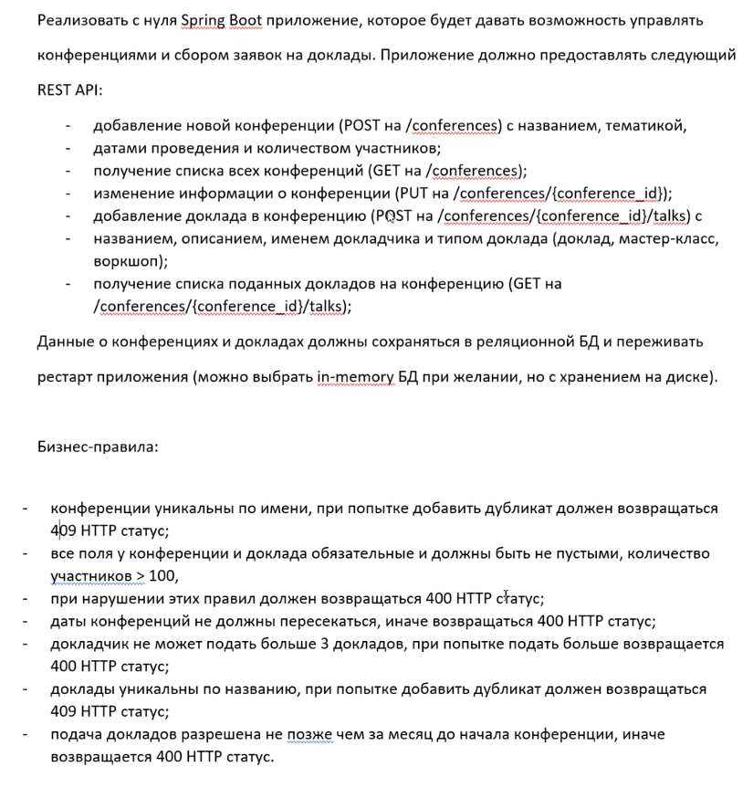

# conferences-service

Project description: Manage conferences and collection of statements to topic.

Project implemented as REST API

Technologies used:
1. Spring Boot 3
2. Spring Data JPA
3. Spring Web
4. Maven
5. OpenAPI Generator
6. Flyway
7. Spring Boot Test
8. Database: Postgres

Test cover levels:
1. Controllers 
2. Services
3. DAO's + Testcontainers
4. End-to-End

Swagger docs: .../conferences/docs or
go to conferences/src/main/resources/api/conferences-api.yaml copy to https://editor.swagger.io/

Swagger-ui: .../conferences/swagger-ui

Description on russian

